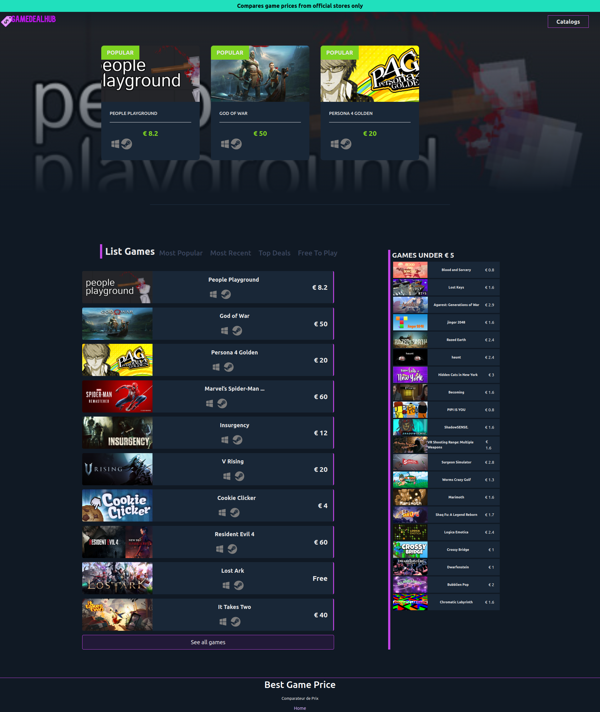
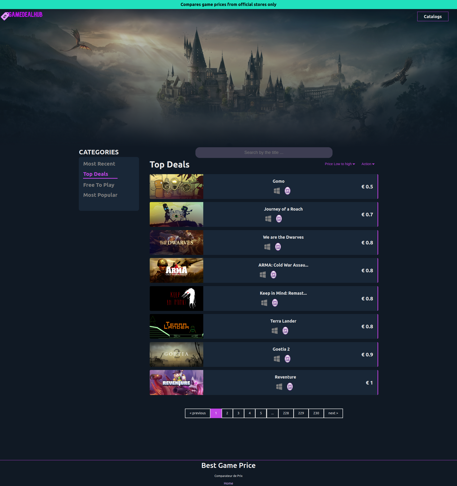
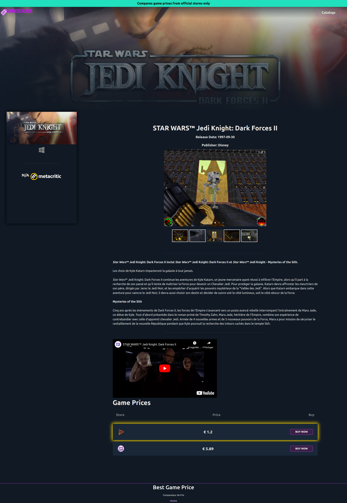

# W51 PROJET

## Membre du groupe
- WAWRZYNIAK Maxime
- KRAUTH Thomas


## SUJET qu'on a choisi
Pour le projet W51 nous avons décidé de faire un comparateur de prix de jeux que nous stockons dans une base de données. Pour récupérer les données, nous avons créé une API.


## DOCUMENTATION
```shell
git clone git@git.unistra.fr:wawrzyniak-krauth/w51-projet.git
# Lancer l'application web
cd w51-projet
npm install
npm run dev
```
<hr>

### API
- API a été fait par nous via une base de données qu'on a sur un serveur à distance.
Notre API est également hébergé sur un serveur distant.

#### URL API : http://gamedealhub.net/API_TOKEN=hvbPup569HAwx-byI2kNc1zLD-6=37DAym/
#### GET
| | | | 
| --- | --- | --- |
| API | URL | Description |
| Filtre Jeux | /api/games/freetoplay/:limit | Retourne (:limit) jeux gratuits |
| Filtre Jeux | /api/games/mostrecents/:limit | Retourne (:limit) jeux les plus récents |
| Filtre Jeux | /api/games/underprice/:price | Retourne les jeux en dessous du (:prix) fixé |
| Filtre Jeux | /api/games/topdeals/:limit | Retourne (:limit) jeux avec le meilleur prix |
| Information d'un jeu | /api/games/:game_id | Retourne les informations d'un jeux |
| Trier jeux les moins cher | /api/games/topdeals/:limit/:sort | Trier
| Trier jeux les plus récents | /api/games/mostrecents/:limit/:sort | Trier
| Trier jeux gratuits | /api/games/freetoplay/:limit/:sort | Trier
| Trier jeux les plus populaires | /api/games/popular/:limit/:sort | Trier
| Rechercher jeux | /api/games/search/:name | Recherche
| Filtrer jeux ayant ce genre | /api/games/:genre_id | Filtrer

## RESSOURCES

### FRAMEWORK
- [Material UI](https://mui.com/)
- Pagination
- Carousel

### AUTRES
- [Sass](https://sass-lang.com/)

# SCREENS

## Page principale


## Catalogue


## Information du jeux
